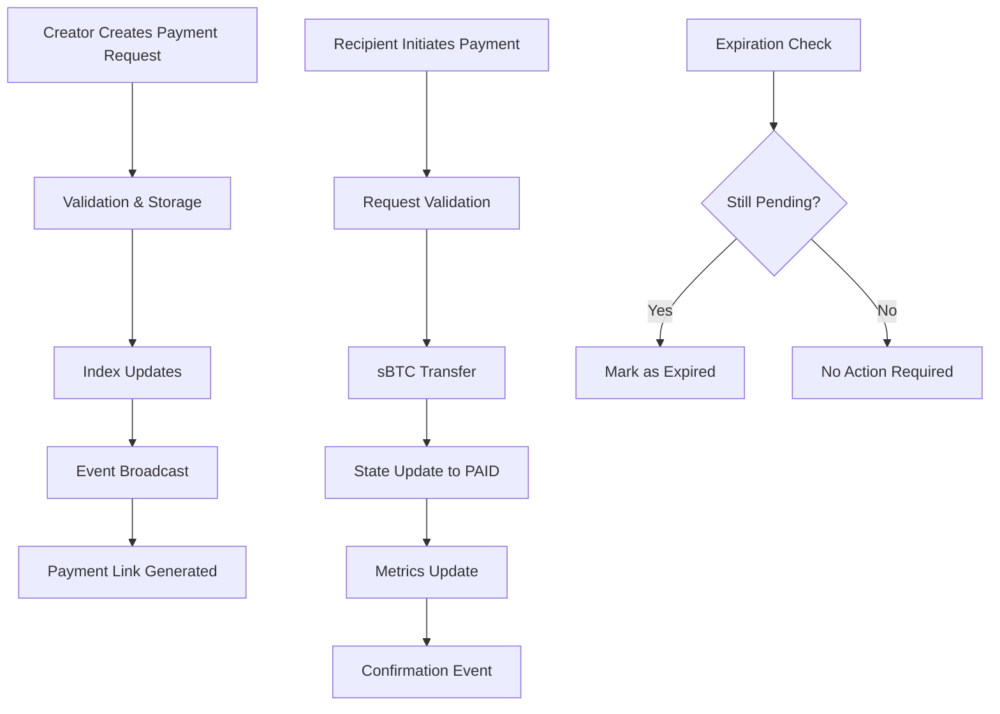

# PayLink Protocol

> **Next-Generation Payment Request System on Stacks Blockchain**

[](LICENSE)
[](package.json)
[](Clarinet.toml)
[](package.json)

## 🌟 Overview

PayLink Protocol is a revolutionary payment infrastructure that transforms how digital payments are requested, tracked, and settled. Built on the Stacks blockchain, it combines Bitcoin's security with smart contract programmability to create secure, time-bound payment requests with automatic state management and real-time settlement verification using sBTC.

### Key Features

- **🔒 Cryptographically Secure**: Payment requests are immutably recorded on-chain with complete audit trails
- **⏰ Time-bound Requests**: Automatic expiration management with configurable timeframes (up to 30 days)
- **🏦 sBTC Integration**: Native support for Bitcoin-backed payments through sBTC tokens
- **📊 Real-time Tracking**: Transparent settlement tracking with verifiable payment proof
- **🛡️ Built-in Security**: Anti-spam measures, authorization controls, and emergency pause functionality
- **📈 Analytics Ready**: Comprehensive protocol metrics and reporting capabilities

## 🏗️ Architecture

### System Overview

```
┌─────────────────┐    ┌─────────────────┐    ┌─────────────────┐
│   Creator       │    │   PayLink       │    │   Recipient     │
│   (Merchant)    │    │   Protocol      │    │   (Customer)    │
└─────────────────┘    └─────────────────┘    └─────────────────┘
         │                       │                       │
         │ 1. create-payment-tag │                       │
         ├──────────────────────►│                       │
         │                       │                       │
         │    2. Payment Link    │                       │
         │◄──────────────────────┤                       │
         │                       │                       │
         │                       │ 3. fulfill-payment    │
         │                       │◄──────────────────────┤
         │                       │                       │
         │ 4. Payment Confirmed  │ 4. sBTC Transfer      │
         │◄──────────────────────┼──────────────────────►│
         │                       │                       │
```

### Contract Architecture

The PayLink Protocol is built around four core components:

#### 1. **Data Storage Layer**

- **`payment-tags`**: Primary storage for payment request details
- **`creator-index`**: Efficient indexing for creator-based queries  
- **`recipient-index`**: Payment tracking for recipients
- **`contract-stats`**: Protocol analytics and metrics

#### 2. **State Management**

- **Pending**: Newly created, awaiting payment
- **Paid**: Successfully fulfilled with sBTC transfer
- **Expired**: Timeout reached, no longer payable
- **Canceled**: Manually canceled by creator

#### 3. **Security Controls**

- Input validation and sanitization
- Authorization checks for sensitive operations
- Anti-spam thresholds and rate limiting
- Emergency pause functionality for protocol administration

#### 4. **Event System**

- Real-time event broadcasting for all state changes
- Comprehensive audit trail for compliance
- Integration-ready event structure for external systems

### Data Flow



## 🚀 Getting Started

### Prerequisites

- [Clarinet CLI](https://docs.hiro.so/stacks/clarinet) v2.0+
- [Node.js](https://nodejs.org/) v18+
- [sBTC Token Contract](https://github.com/stacks-network/sbtc) access

### Installation

1. **Clone the repository**

   ```bash
   git clone https://github.com/femi-bash/PayLink.git
   cd PayLink
   ```

2. **Install dependencies**

   ```bash
   npm install
   ```

3. **Run tests**

   ```bash
   npm test
   ```

4. **Deploy to devnet**

   ```bash
   clarinet integrate
   ```

### Configuration

Update the `SBTC-CONTRACT` constant in `contracts/paylink.clar` to match your target network:

```clarity
;; For Mainnet
(define-constant SBTC-CONTRACT 'SP3DX3H4FEYZJZ586MFBS25ZW3HZDMEW92260R2PR.sbtc-token)

;; For Testnet  
(define-constant SBTC-CONTRACT 'ST1F7QA2MDF17S807EPA36TSS8AMEFY4KA9TVGWXT.sbtc-token)
```

## 📖 Usage

### Creating a Payment Request

```clarity
;; Create a payment request for 0.01 sBTC (1,000,000 satoshis)
;; Valid for 1 day (144 blocks)
(contract-call? .paylink create-payment-tag 
    'ST1CUSTOMER-ADDRESS-HERE 
    u1000000 
    u144 
    (some "Invoice #1234 - Web Design Services"))
```

### Fulfilling a Payment

```clarity
;; Pay the payment request with ID 1
(contract-call? .paylink fulfill-payment-tag u1)
```

### Querying Payment Status

```clarity
;; Get payment details
(contract-call? .paylink get-payment-tag u1)

;; Get all payments created by user
(contract-call? .paylink get-creator-tags tx-sender)

;; Get all payments for recipient
(contract-call? .paylink get-recipient-tags tx-sender)
```

### Managing Payment Requests

```clarity
;; Cancel a pending payment (creator only)
(contract-call? .paylink cancel-payment-tag u1)

;; Expire an overdue payment (anyone can call)
(contract-call? .paylink expire-payment-tag u1)
```

## 📊 Protocol Metrics

The protocol tracks comprehensive metrics:

- **tags-created**: Total payment requests created
- **tags-fulfilled**: Successfully completed payments
- **tags-canceled**: Creator-canceled requests
- **tags-expired**: Automatically expired requests

Query metrics:

```clarity
(contract-call? .paylink get-contract-stats "tags-created")
```

## 🔧 Configuration Parameters

| Parameter | Value | Description |
|-----------|-------|-------------|
| `MAX-EXPIRATION-BLOCKS` | 4,320 | Maximum 30-day expiration period |
| `MAX-TAGS-PER-USER` | 100 | Indexing efficiency limit |
| `MIN-PAYMENT-AMOUNT` | 1,000 | Anti-spam threshold (0.00001 sBTC) |

## 🧪 Testing

Run the comprehensive test suite:

```bash
# Run all tests
npm test

# Run tests with coverage report
npm run test:report

# Run tests in watch mode
npm run test:watch
```

## 🛡️ Security Features

- **Input Validation**: Comprehensive parameter checking
- **Authorization Controls**: Role-based access control
- **Anti-spam Protection**: Minimum payment thresholds
- **Emergency Pause**: Protocol-wide pause capability
- **Audit Trail**: Complete event logging for compliance

## 🤝 Contributing

1. Fork the repository
2. Create your feature branch (`git checkout -b feature/amazing-feature`)
3. Commit your changes (`git commit -m 'Add amazing feature'`)
4. Push to the branch (`git push origin feature/amazing-feature`)
5. Open a Pull Request

## 📜 License

This project is licensed under the ISC License - see the [LICENSE](LICENSE) file for details.

## 🙏 Acknowledgments

- [Stacks Foundation](https://stacks.org/) for the blockchain infrastructure
- [sBTC Team](https://sbtc.tech/) for Bitcoin integration
- [Clarity Language](https://clarity-lang.org/) for smart contract capabilities
